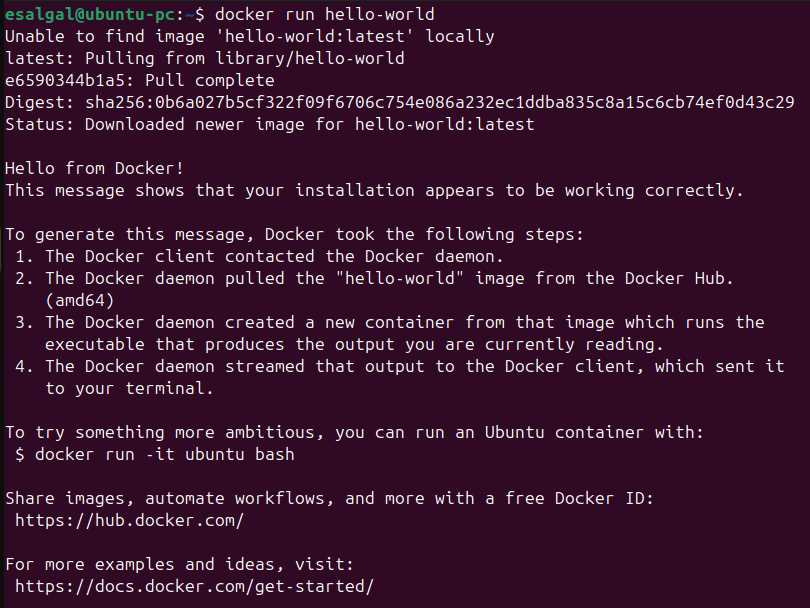
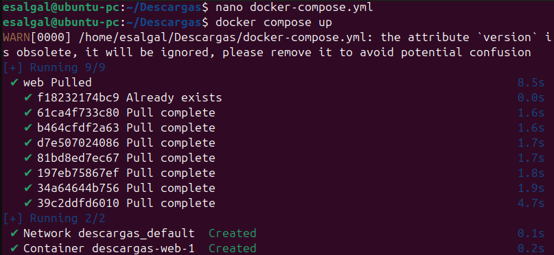
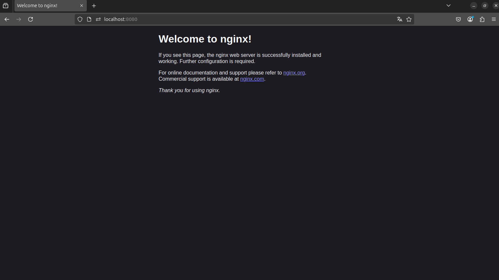

</img>

<h2 style="text-align: center;">Licenciatura en Ingenería en

Tecnologías de la Información y Comunicación Área Redes Inteligentes y Ciberseguridad</h2>

<h3 style="text-align: center;">Automatización de Infraestructura Digital I</h3>

<h4 style="text-align: center;">Unidad 1. Entornos de desarrollo en la automatización de redes</h4>

<br>**Docente:** Eric Domenzain Morales
<br>**Tema:** Instrumento de evaluación
<br>**Nombre del alumno:** Eder Gael Saldaña Galván
<br>**Número de control:** 1222100499
<br>**Grupo:** GIRI5091
<br>

<p style="text-align: right;">Dolores Hidalgo Cuna de la Independencia Nacional, Guanajuato a miércoles 11 de junio del 2025.

# Índice

- [Introducción](#introducción)
- [Desarrollo](#desarrollo)
  - [Descripción de las herramientas utilizadas para automatización](#descripción-de-las-herramientas-utilizadas-para-automatización)
    - [Docker Engine](#docker-engine)
    - [Docker Compose](#docker-compose)
    - [Docker y Swagger (OpenAPI)](#docker-y-swagger-openapi)
  - [Procedimiento de instalación](#procedimiento-de-instalación)
    - [Instalación técnica de herramientas](#instalación-técnica-de-herramientas)
      - [Visual Studio Code](#visual-studio-code)
      - [Plugins y extensiones de Visual Studio Code](#plugins-y-extensiones-de-visual-studio-code)
    - [Instalación técnica de Docker en Ubuntu](#instalación-técnica-de-docker-en-ubuntu)
    - [Instalación técnica de Git](#instalación-técnica-de-git)
- [Evidencia de pruebas de verificación](#evidencia-de-pruebas-de-verificación)
  - [Imagen "hello-world"](#imagen-hello-world)
  - [Ejecución de un archivo yml](#ejecución-de-un-archivo-yml)
- [Conclusión](#conclusión)
- [Bibliografía](#bibliografía)


# Introducción

El siguiente documento es un apartado sobre la configuración de entornos de trabajo en sistemas de desarrollo como lo son Docker, Git y Visual Studio Code, donde hay aspectos fundamentales para garantizar la calidad y rapidez en la entrega de proyectos. Herramientas como Docker y Docker Compose han revolucionado la forma en que se construyen, despliegan y administran aplicaciones, permitiendo encapsular dependencias y servicios en contenedores livianos y fácilmente replicables.

Además, está como objetivo guiar en la instalación, configuración y uso básico de estas herramientas en un sistema operativo basado en Linux, específicamente Ubuntu. Además, se incluyen otras utilidades esenciales como Visual Studio Code para la edición de código y Git para el control de versiones, ofreciendo así una base sólida para cualquier desarrollador o equipo que busque implementar buenas prácticas en sus flujos de trabajo.

A lo largo del desarrollo, también se abordará el uso de Swagger como herramienta de documentación de APIs, así como evidencia visual del funcionamiento de los entornos creados, consolidando una visión práctica e integral de un entorno de desarrollo moderno y automatizado.

# Desarrollo
## Descripción de las herramientas utilizadas para automatización

### Docker Engine

Docker Engine es el componente principal de Docker. Es un motor cliente-servidor que se encarga de crear y ejecutar contenedores. Está compuesto por:

- **Docker Daemon (`dockerd`)**: ejecuta y gestiona contenedores.
- **API REST**: permite la comunicación entre herramientas y el daemon.
- **Cliente Docker (`docker`)**: interfaz de línea de comandos para interactuar con el daemon.

Permite aislar aplicaciones y sus dependencias en contenedores portables, ligeros y reproducibles.

---

### Docker Compose

Docker Compose es una herramienta que simplifica el manejo de aplicaciones con múltiples contenedores. Se usa para:

- Declarar servicios, redes y volúmenes en un solo archivo (`docker-compose.yml`).
- Ejecutar todo el entorno con `docker compose up`.
- Facilitar entornos de desarrollo, pruebas y despliegue.

---

### Docker y Swagger (OpenAPI)

Swagger (ahora parte del estándar OpenAPI) es una herramienta para describir y documentar APIs REST. Aunque **Docker Swagger** no es una herramienta oficial, se refiere a:

- Contenerizar aplicaciones con documentación Swagger.
- Usar contenedores para desplegar herramientas como `Swagger UI`, `Swagger Editor` o `Swagger Codegen`.
- Permite acceder y probar APIs desde una interfaz gráfica web dentro de un contenedor.

## Procedimiento de instalación

### Instalación técnica de herramientas

- **Visual Studio Code**

Visual Studio Code es una herramienta que tiene soporte nativo para gran variedad de lenguajes, entre ellos podemos destacar los principales del desarrollo Web: HTML, CSS, y JavaScript, entre otros.

Para su instalación, podemos seguir los siguientes pasos:

1. Ir al sitio oficial de descarga de Visual Studio Code en el siguiente link: https://code.visualstudio.com/

2. Seleccionar el sistema operativo dependiendo del programa.

3. Descargar el programa correspondiente e instalarlo en el equipo.


- **Plugins y extensiones de Visual Studio Code**

Al ya tener instalado Visual Studio Code en nuestro equipo, podemos potenciar su eficacia y aumentar nuestra productividad al instalar extensiones dependiendo de nuestro trabajo. Para la instalación de extensiones, podemos seguir los siguientes pasos:

1. Dentro de Visual Studio Code, nos dirigimos al apartado de Extensiones

2. Buscamos las extensiones que podrían servirnos, por ejemplo: **extensiones para Python, HTML, Docker, Git, etc.**

## Instalación técnica de Docker en Ubuntu

Para toda la instalación de Docker en un sistema operativo Ubuntu, seguimos el siguiente tutorial: https://docs.docker.com/engine/install/ubuntu/

A continuación, estos son los pasos listados para la instalación usando los repositorios apt:

1. Agregamos los repositorios a nuestro sistema:

```bash
# Add Docker's official GPG key:
sudo apt-get update
sudo apt-get install ca-certificates curl
sudo install -m 0755 -d /etc/apt/keyrings
sudo curl -fsSL https://download.docker.com/linux/ubuntu/gpg -o /etc/apt/keyrings/docker.asc
sudo chmod a+r /etc/apt/keyrings/docker.asc

# Add the repository to Apt sources:
echo \
  "deb [arch=$(dpkg --print-architecture) signed-by=/etc/apt/keyrings/docker.asc] https://download.docker.com/linux/ubuntu \
  $(. /etc/os-release && echo "${UBUNTU_CODENAME:-$VERSION_CODENAME}") stable" | \
  sudo tee /etc/apt/sources.list.d/docker.list > /dev/null
sudo apt-get update
```

2. Instalamos la aplicación de Docker Engine:

```bash
sudo apt-get install docker-ce docker-ce-cli containerd.io docker-buildx-plugin docker-compose-plugin
```

Después de la instalación, es muy recomendable realizar las acciones Post-Installation de Docker, donde podemos usar Docker sin el comando **sudo**. La página a continuación contiene los pasos descritos: https://docs.docker.com/engine/install/linux-postinstall/.

1. Crea el grupo "docker"

```bash
sudo groupadd docker
```

2. Agrega tu usuario al grupo "docker"

```bash
sudo usermod -aG docker $USER
```

3. Cierra y vuelve a iniciar sesión para aplicar cambios, o pon el siguiente comando:

```bash
newgrp docker
```

4. Verifica que puedas usar los comandos sin usar "sudo"

```bash
docker run hello-world
```

## Instalación técnica de Git

Para descargar Git de forma local, podemos seguir los mismos pasos que se usaron para descargar Visual Studio Code en la parte anterior. Por lo tanto, los pasos son algo similares:

1. Ir al sitio oficial de descargas de Git en el siguiente enlace: https://git-scm.com/downloads

2. Selecciona el programa dependiendo de tu sistema operativo.

3. Instala el programa en tu equipo local.

4. Durante la instalación, puedes dejar la mayoría de las opciones por defecto. Asegúrate de seleccionar "Git from the command line and also from 3rd-party software" si quieres usar Git desde PowerShell o CMD.

5. Después de instalado, puedes verificar la instalación con el comando:

```bash
git --version
```

6. Realiza las siguientes configuraciones de comandos para el correcto funcionamiento de Git y su conexión con GitHub, así enlazarás tu usuario con los repositorios locales y en la nube.

```bash
git config --global user.name "Tu Nombre"
git config --global user.email "tu_correo@mailto.com"
```

**Nota:** Para sistemas operativos Linux, Git ya viene instalado por defecto, por lo que si tienes un sistema operativo Linux, puedes ejecutar directamente **git --version**. Sin embargo, si está desactualizada la versión, puedes actualizar Git en tu sistema operativo con los siguientes comandos:

1. En distribuciones como Ubuntu, Debian, Mint y basados en apt:

```bash
sudo add-apt-repository ppa:git-core/ppa -y
sudo apt update
sudo apt install git -y
```

2. En Fedora y distribuciones en dnf:
```bash
sudo dnf install git -y
```

3. En distribuciones con paqueterías yum:

```bash
sudo yum remove git
sudo yum install https://repo.ius.io/ius-release-el$(rpm -E %{rhel}).rpm -y
sudo yum install git236 -y
```

4. Para distribuciones como Arch, Manjaro y basados en pacman:
```bash
sudo pacman -Syu git
```

## Evidencia de pruebas de verificación

### Imagen "hello-world"


### Ejecución de un archivo yml




## Conclusión

Las herramientas de contendores como Docker Engine, Docker Compose y Swagger en los entornos de desarrollo hace más fáciles la automatización, portabilidad y estandarización de aplicaciones. Con Docker, es posible crear entornos reproducibles y ligeros que aíslan las dependencias, permitiendo una integración más fluida entre diferentes etapas del ciclo de vida del software. Con Docker Compose, la orquestación de múltiples servicios se vuelve sencilla y eficiente, mientras que Swagger proporciona una interfaz clara y accesible para la documentación y prueba de APIs REST, mejorando la comunicación entre desarrolladores y usuarios.

Además, la correcta instalación y configuración de herramientas como Visual Studio Code y Git complementa el flujo de trabajo, ofreciendo un entorno robusto para la escritura, control de versiones y colaboración en proyectos. Las pruebas realizadas, como la ejecución del contenedor `hello-world` y de archivos `docker-compose.yml`, demuestran que el entorno se encuentra funcional y preparado para el desarrollo y despliegue de aplicaciones modernas.

Así, este ecosistema de herramientas constituye una base sólida para trabajar con metodologías DevOps, asegurando eficiencia, escalabilidad y calidad en el desarrollo de software.

## Bibliografía

1. Docker. *Install Docker Engine on Ubuntu*. Docker Documentation. Recuperado el 10/06/25, de https://docs.docker.com/engine/install/ubuntu/

2. Docker. *Post-installation steps for Linux*. Docker Documentation. Recuperado el 10/06/25, de https://docs.docker.com/engine/install/linux-postinstall/

3. Microsoft. *Download Visual Studio Code*. Visual Studio Code. Recuperado el 10/06/25, de https://code.visualstudio.com/

4. Git SCM. *Downloads*. Git. Recuperado el 10/06/25, de https://git-scm.com/downloads
